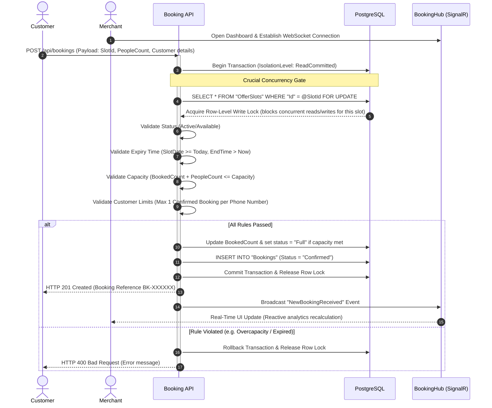

# SmartSlot — Real-Time Flash Offer Booking Platform

SmartSlot is a high-concurrency reservation platform designed to secure time-limited promotional slots (e.g., Happy Hour dining, gym trials, clinic appointments) without overselling. It addresses the classic double-booking problem under high-volume concurrent spikes using database-level pessimistic locking and maintains a live administrative dashboard through real-time WebSockets.

The project is structured as a decoupled full-stack application: a **React + TypeScript** single-page application (SPA) client and an **ASP.NET Core 8 Web API** server backed by a **PostgreSQL** relational database.

---

## 🏗️ Architecture & Technical Design

The system is designed around **Clean Architecture** principles to separate core domain business rules from external frameworks, databases, and UI concerns.

### Project Dependency Structure

```text
                             ┌────────────────────────┐
                             │  SmartOfferBooking.API │ (Presentation Layer)
                             └───────────┬────────────┘
                                         │
                                         ▼
                 ┌──────────────────────────────────────────────┐
                 │       SmartOfferBooking.Infrastructure       │ (Data access, repositories, JWT, EF Core)
                 └───────────────────────┬──────────────────────┘
                                         │
                                         ▼
                 ┌──────────────────────────────────────────────┐
                 │         SmartOfferBooking.Core               │ (Entities, DTOs, interfaces)
                 └──────────────────────────────────────────────┘
```

* **SmartOfferBooking.Core**: Houses domain models (`Booking`, `Offer`, `OfferSlot`, `User`, `Business`), interfaces (`IRepository<T>`), and request/response DTOs. Zero dependencies on external frameworks.
* **SmartOfferBooking.Infrastructure**: Implements database persistence via Entity Framework Core 8, PostgreSQL integration via Npgsql, the generic repository pattern, password hashing via BCrypt, and JWT token generation.
* **SmartOfferBooking.API**: Entry point of the server. Configures dependency injection, routes HTTP controllers, runs background workers, hosts SignalR Hubs, and manages JWT authorization filters.

### System Data Flow



---

## 🔒 Concurrency Control Strategy

The core technical challenge of this application is protecting slot inventory against **race conditions** when hundreds of users attempt to book the last available slot simultaneously.

### Why Optimistic Locking Was Rejected

Optimistic locking (using DB versions/concurrency tokens) is highly performant under low-contention scenarios. However, for flash offers where traffic spikes focus heavily on a single resource (e.g., 50 people trying to book a single table at 12:00 PM), optimistic locking results in excessive transaction rollbacks and a frustrating user experience, forcing clients to retry their requests repeatedly.

### Implementation: Pessimistic Row Locking

SmartSlot uses database-level pessimistic locking via a PostgreSQL transaction. When a booking request is received:

1. A database transaction begins with a `ReadCommitted` isolation level.
2. The server queries the target slot using raw SQL `FOR UPDATE`:

   ```csharp
   var slot = await _context.OfferSlots
       .FromSqlRaw("SELECT * FROM \"OfferSlots\" WHERE \"Id\" = {0} FOR UPDATE", request.SlotId)
       .SingleOrDefaultAsync();
   ```

3. PostgreSQL locks this row immediately. Concurrent threads attempting to read this slot with `FOR UPDATE` are blocked and queued at the database engine level.
4. The server performs all business logic validation sequentially inside the transaction:
   * Checks if the slot is still available or has filled up.
   * Checks the exact capacity and bounds.
   * Checks phone-based booking limits per customer to prevent script-based spam.
5. If validations pass, the `BookedCount` is updated and the booking is saved.
6. The transaction is committed, immediately releasing the database lock. The queued threads then acquire the lock one by one, immediately seeing the updated `BookedCount` and correctly failing the capacity validation rather than double-booking.

---

## 🛠️ Technology Stack & Selection Rationale

### Backend (ASP.NET Core 8 Web API + Entity Framework Core 8)

* **High-Performance Kestrel Server**: Selected for its asynchronous I/O model, capable of handling large volumes of concurrent connections with low memory overhead.
* **EF Core 8 with Postgres**: Offers productive LINQ query capabilities, structural mapping, and migration management while permitting raw SQL fallbacks for low-level features like row-level locking.
* **SignalR**: Provides seamless abstraction over WebSockets with automatic fallback (Server-Sent Events / Long Polling), allowing real-time bi-directional pushes to client dashboards.
* **System.Threading.Channels (Hosted Worker)**: A background worker service (`SlotCleanupWorker`) runs every minute to automatically transition past slots to `Expired` status without blocking main API request flows.

### Frontend (React 19 + TypeScript + Vite + TailwindCSS)

* **Vite**: Provides instant hot module reloading and optimized ESBuild compilation.
* **React 19 Hooks & State**: Drives responsive interfaces, using state machines to render SVG dispersion line charts and real-time transaction tables.
* **TailwindCSS**: Chosen for rapid, maintainable design implementations using modern styling (glassmorphism details, CSS micro-animations, light/dark modes).
* **Progressive Web App (PWA)**: Implemented via custom service workers (`sw.js`) and client cache policies to enable installation on mobile devices, custom splash screens, and offline resource availability.

---

## 📂 Project Structure

```text
smart-offer-booking-slot/
├── database/
│   └── schema.sql                  # PostgreSQL table creation scripts and indexes
├── backend/
│   ├── SmartOfferBooking.sln       # Visual Studio / .NET CLI solution file
│   ├── Dockerfile                  # Multi-stage build for production release
│   ├── .dockerignore               # Optimized Docker context filters
│   ├── SmartOfferBooking.Core/     # Domain layer: Entities, DTO structures, interfaces
│   │   ├── Entities/               # User.cs, Offer.cs, OfferSlot.cs, Booking.cs, Business.cs
│   │   ├── DTOs/                   # AuthDTOs, BookingDTOs, OfferDTOs, SlotDTOs, DashboardDTOs
│   │   └── Interfaces/             # Generic repository contract (IRepository.cs)
│   ├── SmartOfferBooking.Infrastructure/ # Persistence layer: DbContext, Repository implementations
│   │   ├── Data/                   # EF Core DbContext mapping and constraint validations
│   │   ├── Repositories/           # Repository implementations
│   │   └── Services/               # Password hashing (BCrypt) & JWT Token Generator
│   └── SmartOfferBooking.API/      # Presentation layer: REST Controllers, SignalR Hubs, Background workers
│       ├── Controllers/            # Auth, Offers, Slots, Bookings, Dashboard, Business
│       ├── Hubs/                   # SignalR BookingHub endpoint
│       ├── Middleware/             # Global exception interceptor
│       ├── Services/               # SlotCleanupWorker background tasks
│       └── Program.cs              # Service configurations and database seeder
└── frontend/
    ├── package.json                # Dependencies and npm script targets
    ├── vite.config.ts              # Bundler optimization rules and code splitting config
    ├── tailwind.config.js          # Theme overrides and color palettes
    ├── postcss.config.js           # CSS processing pipeline
    ├── index.html                  # Entry document injecting PWA manifest
    ├── public/                     
    │   ├── manifest.json           # Web app manifest for PWA capabilities
    │   ├── sw.js                   # Service Worker cache rules and runtime offline handlers
    │   └── _redirects              # Rewrite rules for SPA routers (Netlify/Vercel)
    └── src/
        ├── main.tsx                # Client bootstrapper
        ├── App.tsx                 # Route declarations
        ├── index.css               # Styling rules and design tokens
        ├── components/             # Reusable UI widgets (CoverImage, Layout, QRCode)
        └── pages/                  # Routable page templates:
            ├── AdminDashboard.tsx  # Analytics, live log feeds, concurrency stress test generator
            ├── PublicOfferListing. # Catalog of available offers
            ├── PublicOfferDetail.  # Selected offer, available slots list, check-out panel
            ├── CustomerBookings.   # Logged-in customer booking dashboard
            └── CreateOffer.tsx     # Merchant form to define offers and generate custom slots
```

---

## ⚡ Concurrency Stress Tester (Built-in Demo)

To visually demonstrate database locking mechanics under load, the project features a **concurrency stress tester** built directly into the merchant panel (`AdminDashboard.tsx`):

1. **Jitter-based parallel triggers**: The tester launches 50 concurrent booking requests targeting a single slot simultaneously.
2. **Kestrel OS Threading**: Each request is scheduled via micro-jitters (0-60ms delay) to force real OS-level thread concurrency in the backend server.
3. **Pessimistic Gate Evaluation**: Under load, the database blocks concurrent writes. Only requests matching the remaining capacity are saved as `Confirmed`.
4. **Lock Rejections**: Once capacity limit is reached, all remaining parallel requests are rejected with a capacity error, logging validation failures in real-time.

---

## 🔌 API Endpoint Documentation

### Authentication (`api/auth`)

* `POST /api/auth/register`: Create a new User record. Hashes password using BCrypt.
* `POST /api/auth/login`: Validate credentials. Returns a signed JWT containing username, role, and email claims.

### Offers & Slots (`api/offers` / `api/slots`)

* `GET /api/offers`: Lists all active promotional offers, including nested available slots.
* `POST /api/offers`: Creates a new offer and auto-generates child slots based on start/end dates and capacity rules.
* `GET /api/slots/offer/{offerId}`: Retrieves slot listings for a single offer.
* `PUT /api/slots/{id}`: Modify a slot's capacity or status manually.

### Booking & Transaction Engine (`api/bookings`)

* `POST /api/bookings`: Processes a slot booking request. Runs inside a pessimistic write lock transaction.
* `GET /api/bookings/my-bookings`: Fetches booking records for the logged-in customer (requires JWT authorization header).
* `PUT /api/bookings/{id}/status`: Updates a booking's status (e.g. Completed, Cancelled, No Show). Updates slot counts if cancelled to release reserved slots.

---

## ⚙️ Installation & Local Setup

### Prerequisites

* **Node.js**: v18 or later
* **.NET SDK**: v8.0
* **PostgreSQL**: v15 or later

### 1. Database Configuration

Create a PostgreSQL database named `smart_offer_booking` and run the schema setup script:

```bash
psql -U postgres -d smart_offer_booking -f database/schema.sql
```

### 2. Backend Server Configuration

1. Navigate to the API directory:

   ```bash
   cd backend/SmartOfferBooking.API
   ```

2. Create `appsettings.Development.json` using `appsettings.json` as a template and provide your database credentials:

   ```json
   {
     "ConnectionStrings": {
       "DefaultConnection": "Host=localhost;Database=smart_offer_booking;Username=postgres;Password=YOUR_PASSWORD"
     },
     "Jwt": {
       "Secret": "A_Secure_Random_Key_At_Least_32_Characters_Long"
     }
   }
   ```

3. Restore packages and launch the server:

   ```bash
   dotnet restore
   dotnet run
   ```

   The backend will launch at `http://localhost:5000` (HTTP) and `https://localhost:5001` (HTTPS). Swagger UI is available at `http://localhost:5000/swagger`.

### 3. Frontend Client Configuration

1. Navigate to the frontend directory:

   ```bash
   cd frontend
   ```

2. Create `.env` from the `.env.example` template:

   ```env
   VITE_API_URL=http://localhost:5000
   ```

3. Install dependencies and start the Vite development server:

   ```bash
   npm install
   npm run dev
   ```

   The client application will start at `http://localhost:5173`.

---

## 📈 Challenges, Lessons Learned & Future Improvements

### Challenges Faced

* **Concurrency Locking in EF Core**: Entity Framework Core does not offer clean native abstractions for pessimistic row-level locking statements (like `SELECT ... FOR UPDATE`). We solved this by using raw SQL mapping (`FromSqlRaw`) directly on the locked transaction context, ensuring the ORM's change tracker is updated while using raw SQL locking performance.
* **Real-Time Synchronisation Over WebSockets**: In multi-merchant environments, broadcasting all booking confirmations to all connected dashboards creates performance issues. We resolved this by routing notifications to the client dashboard, though a grouped SignalR Hub model mapping connection IDs to specific merchants would be better for multi-tenant isolation.
* **Offline Asset Availability**: In PWA environments, cached assets must update seamlessly when updates are deployed. We designed cache control logic inside the service worker (`sw.js`) to handle asset invalidation on index change.

### Lessons Learned

* **Pessimistic vs. Optimistic Lock Trade-offs**: In high-contention resource booking (like flash offers), pessimistic row locking is more practical than optimistic version checks since it manages race conditions at the database layer and avoids client-side request loops.
* **Keep Transactions Lean**: To avoid database thread pool exhaustion and deadlocks, validations that don't depend on locked rows should be run before locking the row.
* **Autoscaling Background Tasks**: Background cleanup workers must use scoped DB context providers to avoid memory leaks and DB connection exhaustion in long-running services.

### Future Improvements

1. **Redis Distributed Locks**: Replace database row locking with a Redis-based distributed lock (using Redlock) to allow horizontal scaling of the API servers across multiple cloud nodes.
2. **Token Bucket Rate Limiting**: Implement token bucket rate limiting on the `/api/bookings` route at the API gateway layer to prevent denial-of-service attempts during flash booking events.
3. **Notification Message Queue**: Offload SMS/Email notification dispatches to an asynchronous background worker queue (like RabbitMQ or Amazon SQS) to keep the booking request execution path as fast as possible.
